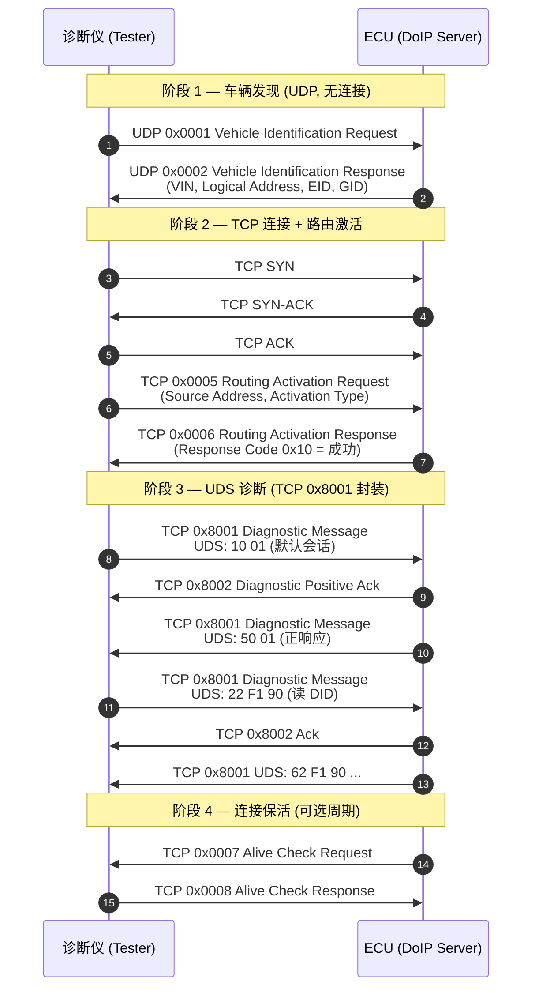

# DoIP 完整时序图（任务 1.2 产出模板）

> 请对照本图 **手绘一版** 并标注 Payload Type；手绘比只看图记忆更深。

## 正常诊断会话时序



## 手绘检查清单

画完后确认图中是否包含：

- [ ] 每条箭头标注 **UDP 或 TCP**
- [ ] 每个 DoIP 报文标注 **Payload Type（十六进制）**
- [ ] TCP 三次握手在 **0x0005 之前**
- [ ] UDS 字节画在 **0x8001 框内**（而非单独一层）
- [ ] Alive Check 方向：通常 **ECU 主动发 0x0007**

## 简化 ASCII 版（便于打印临摹）

```
[Tester]                              [ECU]
   |  UDP 0x0001 (Vehicle ID Req)  -->  |
   |  <--  UDP 0x0002 (Vehicle ID Resp) |
   |                                    |
   |  TCP SYN ---------------------->  |
   |  <---------------------- SYN-ACK  |
   |  ACK -------------------------->  |
   |  TCP 0x0005 (Routing Act Req) -->  |
   |  <--  TCP 0x0006 (Routing Act Resp)|
   |                                    |
   |  TCP 0x8001 [10 01] ----------->  |
   |  <--  TCP 0x8002 (Pos Ack)        |
   |  <--  TCP 0x8001 [50 01]          |
   |                                    |
   |  <--  TCP 0x0007 (Alive Check)    |
   |  TCP 0x0008 (Alive Resp) ------->  |
```

## 与 CAN UDS 时序的「叠加理解」

```
CAN 世界:  [Tester] --ISO-TP/UDS--> [ECU]
DoIP 世界: [Tester] --DoIP头+TCP--> [Dcm 仍处理同样 UDS]
```

同一 UDS 状态机（会话、安全访问、NRC）在 Dcm 内执行；变化的是 **Tester 到 Dcm 之间多了一层 DoIP + TCP**。

## 任务 1.2 完成标准

- [ ] 手绘时序图照片或扫描件（或数字平板导出）
- [ ] 能脱离文档默画「发现 → 激活 → 0x10 会话」最小路径
- [ ] 完成 `README.md` 中 5 道自测题
